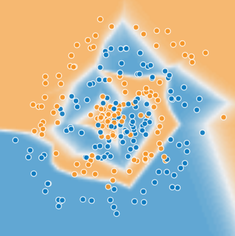
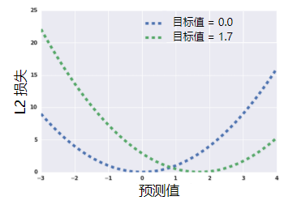
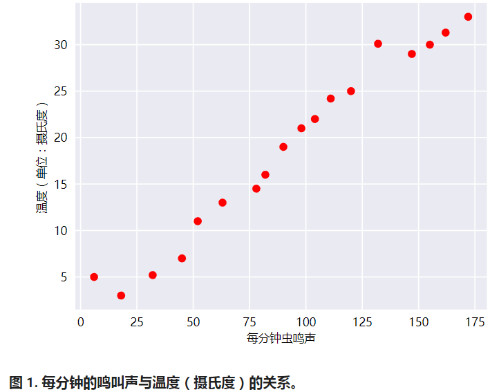
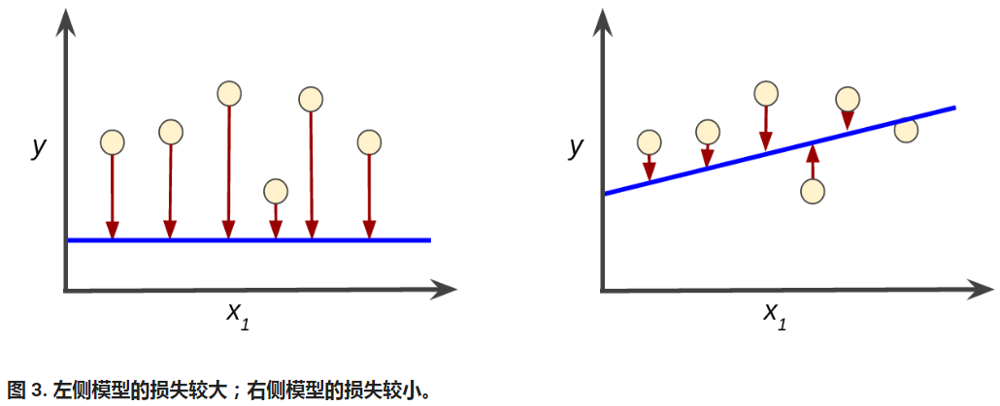
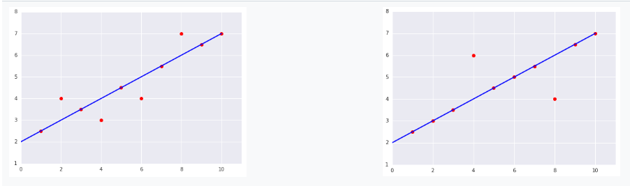

[TOC]

# 深入了解机器学习 (Descending into ML)

**线性回归（linear regression）**是一种找到最适合一组点的直线或超平面的方法。本模块会先直观介绍线性回归，为介绍线性回归的机器学习方法奠定基础。

## 学习目标

- 复习前面学过的直线拟合知识。
- 将机器学习中的权重和偏差与直线拟合中的斜率和偏移关联起来。
- 大致了解“损失”（loss），详细了解平方损失。

## 从数据中学习

- 您可以使用很多种复杂的方法从数据中学习
- 但我们可以从简单且熟悉的内容入手
- 从简单的内容入手可打开通往一些广泛实用方法的大门




## 线性回归示例：房价预测

x：房子面积

y：房价

图中的蓝色点表示输入数据，我们需要根据当前数据拟合出一条直线：y'=wx+b


## 好用的回归损失函数

给定样本的 **L2 损失**也称为平方误差

= 预测值和标签值之差的平方

= (标签值 - 预测值)^2

= (y - y')^2

对于上述放假预测实例，我们可以通过 **L2损失** 来衡量拟合直线的好坏。

如上图所示，红色的线段数学意义为{预测值 - 标签值} : {y' - y} ，这里的{y' - y}就表示误差。 (y - y')^2即表示 L2损失。



注：上图中目标值就是标签值。

## 定义数据集上的 L2 损失

$$(L_{2}Loss=\sum_{(x,y)\in D}(y-prediction(x))^{2})$$

∑: 我们对训练集中的所有样本进行求和。

D: 有时取平均值也会有用， 除以$$\frac{1}{\left \| N \right \|}$$

## 线性回归

人们[早就知晓](https://wikipedia.org/wiki/Dolbear's_law)，相比凉爽的天气，蟋蟀在较为炎热的天气里鸣叫更为频繁。数十年来，专业和业余昆虫学者已将每分钟的鸣叫声和温度方面的数据编入目录。Ruth 阿姨将她喜爱的蟋蟀数据库作为生日礼物送给您，并邀请您自己利用该数据库训练一个模型，从而预测鸣叫声与温度的关系。

首先建议您将数据绘制成图表，了解下数据的分布情况：



毫无疑问，此曲线图表明温度随着鸣叫声次数的增加而上升。鸣叫声与温度之间的关系是线性关系吗？是的，您可以绘制一条直线来近似地表示这种关系，如下所示：


事实上，虽然该直线并未精确无误地经过每个点，但针对我们拥有的数据，清楚地显示了鸣叫声与温度之间的关系。只需运用一点代数知识，您就可以将这种关系写下来：**y=mx+b**

其中：

- y 指的是温度（以摄氏度表示），即我们试图预测的值。
- m 指的是直线的斜率。
- x 指的是每分钟的鸣叫声次数，即输入特征的值。
- b 指的是 y 轴截距。

按照机器学习的惯例，您需要写一个存在细微差别的模型方程式：**y′=b+w1x1**

其中：

- y′ 指的是预测[标签](https://developers.google.com/machine-learning/crash-course/framing/ml-terminology#labels)（理想输出值）。
- b 指的是偏差（y 轴截距）。而在一些机器学习文档中，它称为 w0。
- w1 指的是特征 1 的权重。权重与上文中用 m 表示的“斜率”的概念相同。
- x1 指的是[特征](https://developers.google.com/machine-learning/crash-course/framing/ml-terminology#features)（已知输入项）。

要根据新的每分钟的鸣叫声值 x1 **推断**（预测）温度 y′，只需将 x1 值代入此模型即可。

下标（例如 w1 和 x1）预示着可以用多个特征来表示更复杂的模型。例如，具有三个特征的模型可以采用以下方程式：**y′=b+w1x1+w2x2+w3x3**

##  关键字词

| [偏差](https://developers.google.com/machine-learning/glossary#bias) | [推断](https://developers.google.com/machine-learning/glossary#inference) |
| ---------------------------------------- | ---------------------------------------- |
| [线性回归](https://developers.google.com/machine-learning/glossary#linear_regression) | [权重](https://developers.google.com/machine-learning/glossary#weight) |

## 训练与损失

简单来说，**训练**模型表示通过**有标签样本**来学习（确定）所有权重和偏差的理想值。在监督式学习中，机器学习算法通过以下方式构建模型：检查多个样本并尝试找出可最大限度地减少损失的模型；这一过程称为**经验风险最小化**。

损失是对糟糕预测的惩罚。也就是说，**损失**是一个数值，表示对于单个样本而言模型预测的准确程度。如果模型的预测完全准确，则损失为零，否则损失会较大。**训练模型的目标是从所有样本中找到一组平均损失“较小”的权重和偏差。**例如，图 3 左侧显示的是损失较大的模型，右侧显示的是损失较小的模型。关于此图，请注意以下几点：

- 红色箭头表示损失。
- 蓝线表示预测。



 

请注意，左侧曲线图中的红色箭头比右侧曲线图中的对应红色箭头长得多。显然，相较于左侧曲线图中的蓝线，右侧曲线图中的蓝线代表的是预测效果更好的模型。

您可能想知道自己能否创建一个数学函数（损失函数），以有意义的方式汇总各个损失。

### 平方损失：一种常见的损失函数

接下来我们要看的线性回归模型使用的是一种称为**平方损失**（又称为 **L2 损失**）的损失函数。单个样本的平方损失如下：

```
  = the square of the difference between the label and the prediction
  = (observation - prediction(x))^2
  = (y - y')^2
```

**均方误差** (**MSE**) 指的是每个样本的平均平方损失。要计算 MSE，请求出各个样本的所有平方损失之和，然后除以样本数量：

$$MSE = \frac{1}{N}\sum_{(x,y)\in D}(y-prediction(x))^{2}$$

其中：

- (x,y)指的是样本，其中
  - x 指的是模型进行预测时使用的特征集（例如，温度、年龄和交配成功率）。
  - y 指的是样本的标签（例如，每分钟的鸣叫次数）。
- prediction(x) 指的是权重和偏差与特征集 x 结合的函数。
- D 指的是包含多个有标签样本（即 (x,y)）的数据集。
- N 指的是 D 中的样本数量。

虽然 MSE 常用于机器学习，但它既不是唯一实用的损失函数，也不是适用于所有情形的最佳损失函数。

## 关键字词

| [经验风险最小化](https://developers.google.com/machine-learning/glossary#ERM) | [损失](https://developers.google.com/machine-learning/glossary#loss) |
| ---------------------------------------- | ---------------------------------------- |
| [均方误差](https://developers.google.com/machine-learning/glossary#MSE) | [平方损失](https://developers.google.com/machine-learning/glossary#squared_loss) |
| [训练](https://developers.google.com/machine-learning/glossary#training) |                                          |

## 练习题

### 均方误差

请看以下两个曲线图：



**对于以上曲线图中显示的两个数据集，哪个数据集的均方误差 (MSE) 较高？**

A.左侧的数据集

B.右侧的数据集

答案解析：正确答案是B。

左侧曲线图，线上的 6 个样本产生的总损失为 0。不在线上的 4 个样本离线并不远（距离都为1），因此即使对偏移求平方值，产生的值仍然很小。根据MSE公式，求得左侧数据集的均方误差为：0.4。

线上的 8 个样本产生的总损失为 0。不过，尽管只有两个点在线外，但这两个点的离线距离依然是左图中离群点的 2 倍。平方损失进一步加大差异，因此两个点的偏移量产生的损失是一个点的 4 倍。根据MSE公式，求得左侧数据集的均方误差为：0.8。

因此右侧数据集的MSE值 = 0.8 > 左侧数据集的MSE值 = 0.4，故选B。


# Reference

[深度了解机器学习（Descending into ML）](https://developers.google.com/machine-learning/crash-course/descending-into-ml)